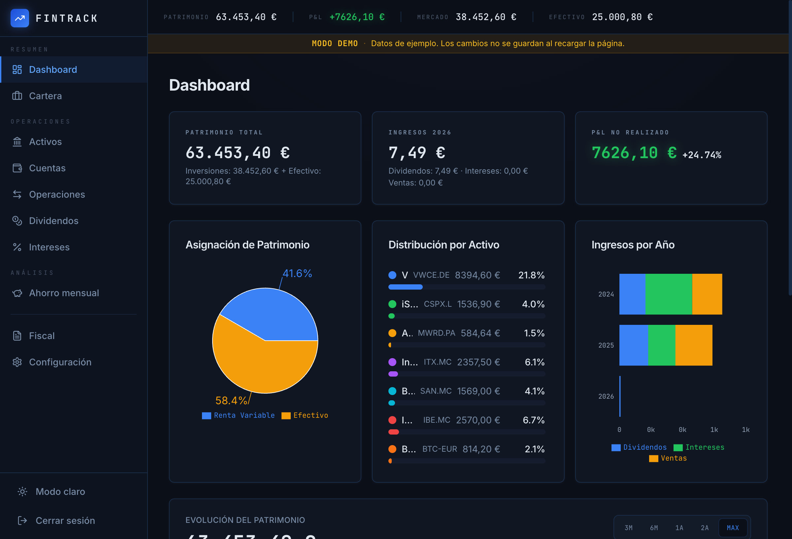
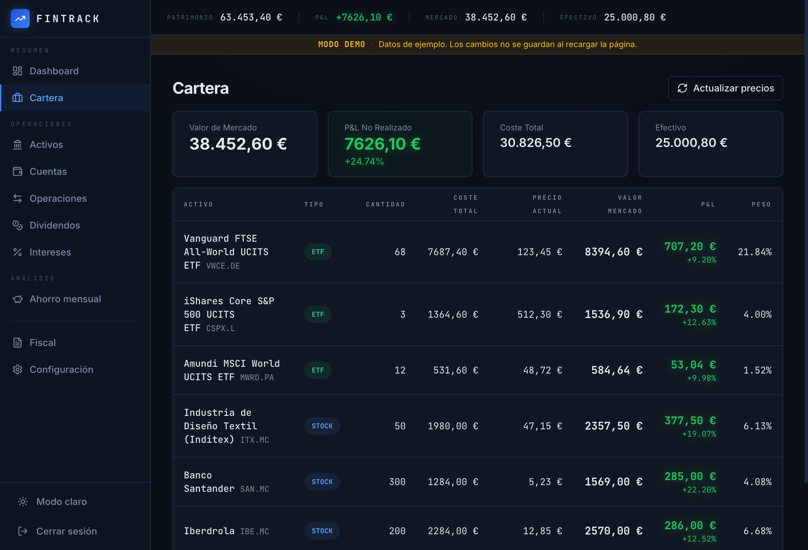
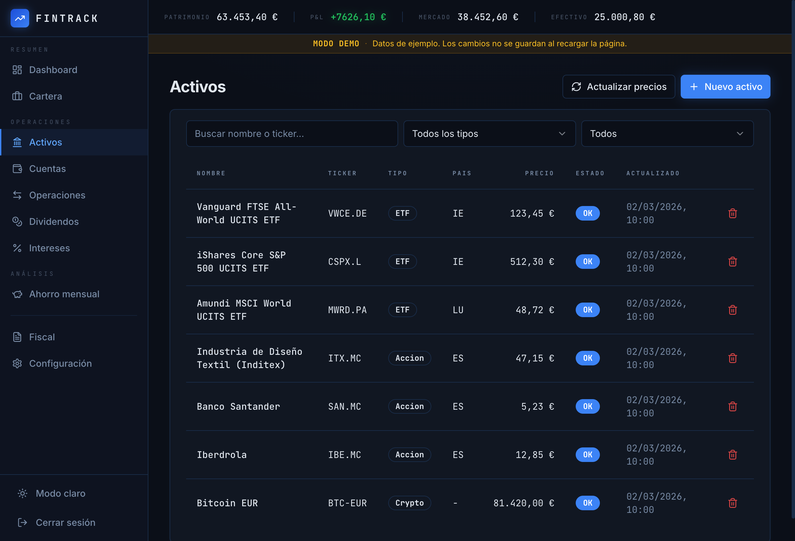
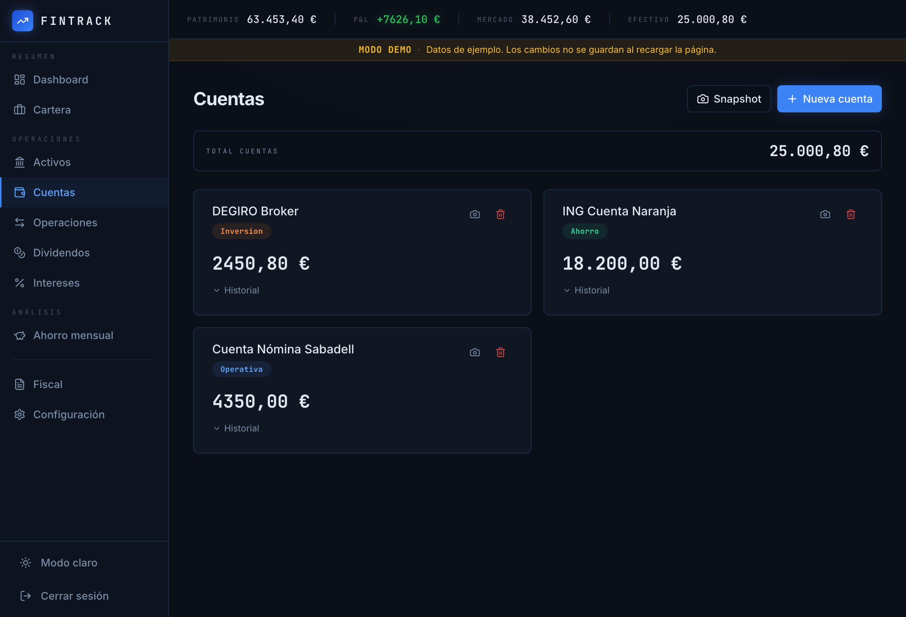
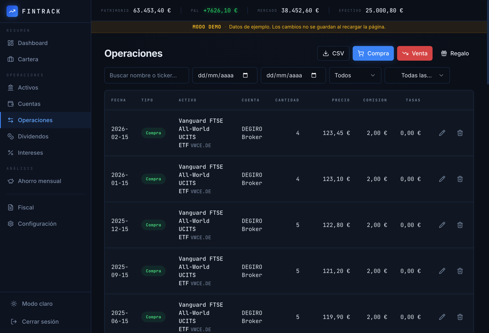
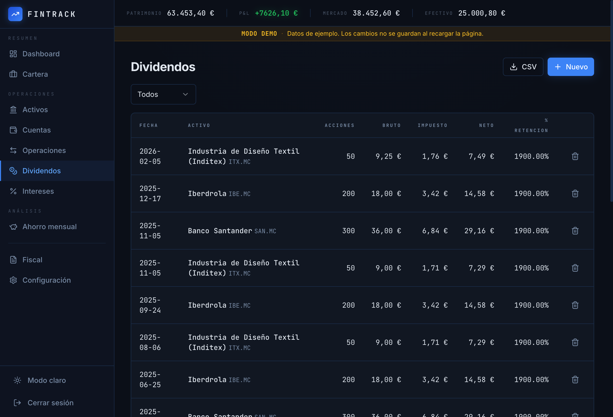
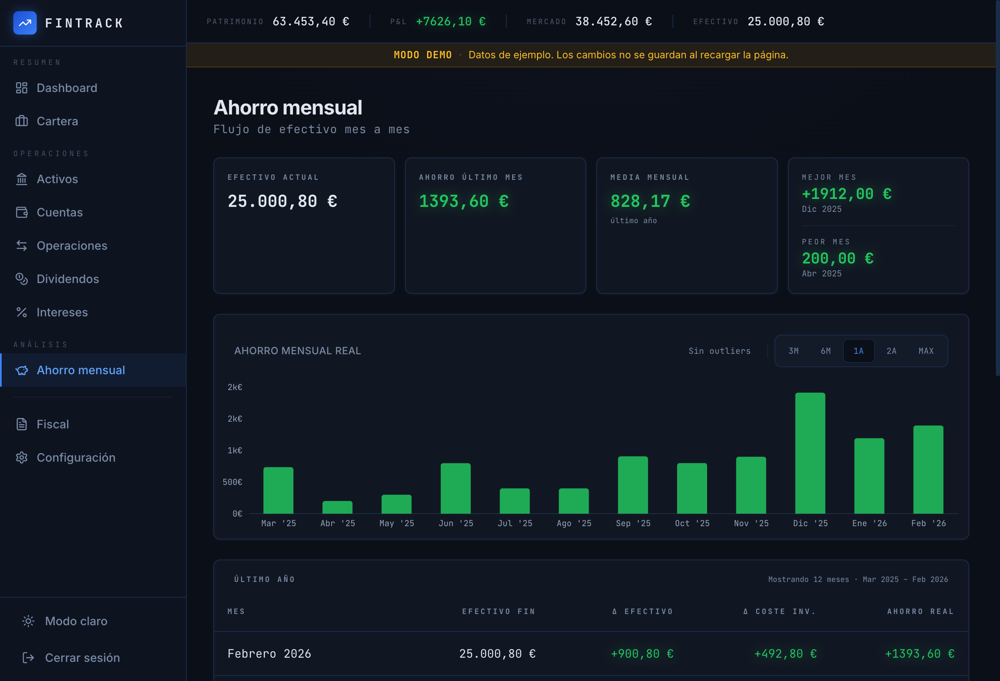
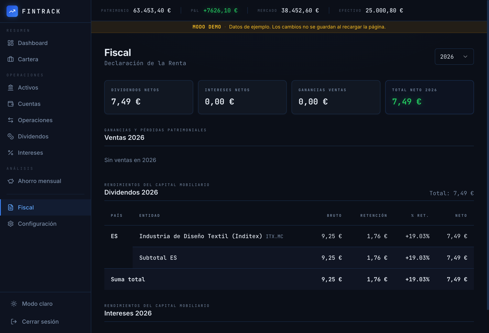
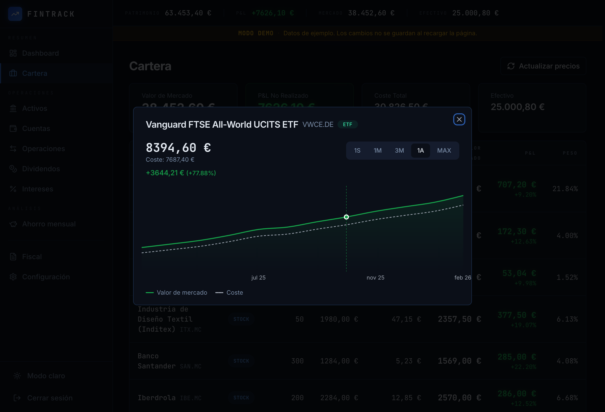
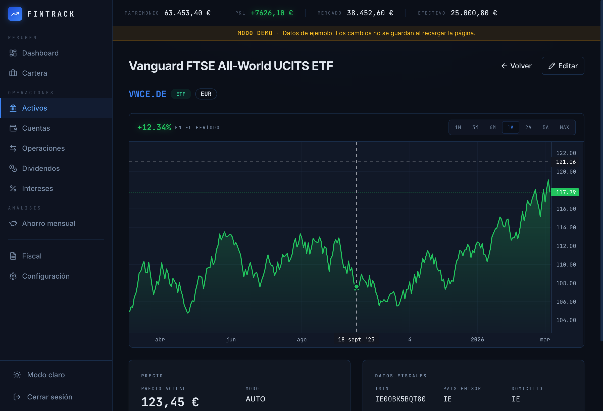

<div align="center">

# Fintrack

**Self-hosted investment portfolio tracker — built for privacy and clarity.**

Track your portfolio, transactions, dividends, interests and taxes from a single interface. No subscriptions, no data sharing, fully open source.

[](LICENSE)
[](https://github.com/Gonzalez8/fintrack/actions/workflows/ci.yml)
[](https://www.djangoproject.com/)
[](https://nextjs.org/)
[](https://react.dev/)
[](https://www.typescriptlang.org/)
[](https://www.docker.com/)

</div>

---

## Screenshots

<p align="center">
  
  
</p>
<p align="center">
  
  
</p>
<p align="center">
  
  
</p>
<p align="center">
  
  
</p>
<p align="center">
  
  
</p>

---

## Features

### Portfolio Management
- **Multi-asset support** — Stocks, ETFs, Funds, Crypto
- **Real-time pricing** — Automatic updates via Yahoo Finance
- **Cost basis engines** — FIFO, LIFO, and Weighted Average Cost (WAC)
- **Position tracking** — Unrealized P&L, cost basis, market value per position

### Transaction Tracking
- **Buy / Sell / Gift** transactions with commission and tax support
- **Dividend tracking** — Gross, tax, net, withholding rate per asset
- **Interest income** — Date-range based tracking per account
- **Import deduplication** — Hash-based duplicate detection

### Accounts & Snapshots
- **Multiple account types** — Operativa, Ahorro, Inversion, Depositos, Alternativos
- **Balance snapshots** — Historical balance tracking with auto-sync
- **Portfolio snapshots** — Periodic automated snapshots via Celery Beat

### Reports & Analytics
- **Year summary** — Dividends, interests, realized P&L, total income by year
- **Patrimonio evolution** — Total net worth over time (cash + investments)
- **Portfolio evolution** — Market value, cost basis, unrealized P&L charts
- **Monthly savings** — Cashflow and savings rate analysis
- **CSV exports** — Transactions, dividends, and interests

### Security & Auth
- **JWT in httpOnly cookies** — Access + refresh tokens, SameSite=Lax
- **Google OAuth 2.0** — One-click login with automatic account creation
- **Rate limiting** — Per-endpoint throttling (login, register, password change)
- **Multi-tenancy** — Strict owner-based data isolation

### Internationalization
- **5 languages** — Spanish, English, German, French, Italian

---

## Quick Start

### Option 1: Docker Compose (development)

```bash
git clone https://github.com/Gonzalez8/Fintrack.git && cd Fintrack
cp .env.example .env
docker compose up
```

| Service | URL |
|---|---|
| App | `http://localhost:3000` |
| API | `http://localhost:8000/api/` |
| Swagger UI | `http://localhost:8000/api/schema/swagger-ui/` |
| Django Admin | `http://localhost:8000/admin/` |

Create a superuser (optional):

```bash
docker compose exec backend python manage.py createsuperuser
```

### Option 2: Production (Pre-built Images)

No source code needed — uses images from GitHub Container Registry.

```bash
mkdir fintrack && cd fintrack
curl -O https://raw.githubusercontent.com/Gonzalez8/Fintrack/main/docker-compose.prod.yml
curl -O https://raw.githubusercontent.com/Gonzalez8/Fintrack/main/nginx.conf
curl -O https://raw.githubusercontent.com/Gonzalez8/Fintrack/main/.env.production.example
cp .env.production.example .env
# Edit .env with your values (DB_PASSWORD, DJANGO_SECRET_KEY, etc.)
docker compose -f docker-compose.prod.yml up -d
```

The superuser is created automatically on first start (`admin` / `admin` by default — change in `.env`).

> Always set strong, unique values for `DB_PASSWORD`, `DJANGO_SECRET_KEY` and `DJANGO_SUPERUSER_PASSWORD` before deploying.

### Option 3: Portainer

1. In Portainer, go to **Stacks > Add stack**
2. Paste the contents of [`docker-compose.prod.yml`](docker-compose.prod.yml)
3. Add the required [environment variables](#environment-variables)
4. Click **Deploy the stack**

### Option 4: Live Demo (Vercel, no backend)

A static frontend-only demo using [MSW (Mock Service Worker)](https://mswjs.io/) — no database or backend needed.

| Vercel Setting | Value |
|---|---|
| Root Directory | `frontend` |
| Build Command | `npm run build` |
| Environment Variable | `NEXT_PUBLIC_DEMO_MODE=true` |

**Test demo locally:**

```bash
cd frontend && NEXT_PUBLIC_DEMO_MODE=true npm run dev
```

---

## Architecture

```
┌─────────────────────────────────────────────────────────────┐
│                        Browser                              │
└──────────────────────────┬──────────────────────────────────┘
                           │
              ┌────────────▼────────────┐
              │      Nginx (port 80)    │  Reverse proxy
              └──┬──────────────────┬───┘
                 │                  │
          /api/* │ /admin/* /static/*  │ /*
          ┌──────▼──────┐    ┌──────▼──────┐
          │  Django 5.1 │    │  Next.js 16 │
          │  Gunicorn   │    │  SSR + BFF  │
          │  Port 8000  │    │  Port 3000  │
          └──┬─────┬───┘    └─────────────┘
             │     │
    ┌────────▼┐  ┌─▼────────┐
    │ Postgres │  │  Redis   │
    │   :5432  │  │  :6379   │
    └──────────┘  └─┬────┬───┘
                    │    │
          ┌─────────▼┐ ┌─▼──────────┐
          │  Celery  │ │ Celery Beat │
          │  Worker  │ │  Scheduler  │
          └──────────┘ └─────────────┘
```

### BFF Pattern

The browser **never** calls the Django API directly. All requests flow through Next.js Route Handlers (`/api/proxy/*`), which:
1. Read JWT from httpOnly cookies
2. Forward the request to Django with the Authorization header
3. Handle token refresh transparently
4. Return the response to the browser

### Rendering Strategy

| Route Group    | Strategy           | Description                        |
| -------------- | ------------------ | ---------------------------------- |
| `(marketing)/` | SSG                | Landing page, static generation    |
| `(auth)/`      | Client Components  | Login, Register forms              |
| `(dashboard)/` | SSR + Streaming    | Server Components + React Suspense |

---

## Security & Authentication

### JWT token flow

```
Browser
  ├── Cookie ──► access token  (httpOnly, SameSite=Lax)
  └── Cookie ──► refresh token (httpOnly, SameSite=Lax)
        │
        └─► POST /api/auth/token/refresh/  ──►  new access token
```

- Refresh token rotates on every use and is blacklisted after rotation (replay-safe).
- All requests attach Bearer token automatically; 401 triggers a single transparent retry.

### Google OAuth2

```
1. Load Google GIS script on login page
2. User clicks "Continue with Google"
3. Google returns an ID token (credential)
4. POST /api/auth/google/ { credential }
5. Backend verifies token with Google's public keys
6. Get or create user by email
7. Issue JWT pair → login complete
```

**Setup:**
1. [Create an OAuth 2.0 Client ID](https://console.cloud.google.com/apis/credentials) (Web application)
2. Add your domain to **Authorized JavaScript origins**
3. Set `GOOGLE_CLIENT_ID=<your-id>` in `.env`

---

## Tech Stack

| Layer | Technology |
|---|---|
| **Backend** | Django 5.1 · Django REST Framework 3.15 · PostgreSQL 16 · Celery 5.3 · Redis 7 |
| **Auth** | djangorestframework-simplejwt · google-auth |
| **Frontend** | Next.js 16 · React 19 · TypeScript 5 · Tailwind CSS v4 · shadcn/ui (Radix) |
| **State** | TanStack Query 5 (server state) |
| **Charts** | Recharts 3 · Lightweight Charts 5 |
| **i18n** | next-intl (es, en, de, fr, it) |
| **Infra** | Docker Compose · GitHub Actions CI · GHCR |
| **API Docs** | drf-spectacular (OpenAPI 3 / Swagger UI) |

---

## Project Structure

```
fintrack/
├── backend/                       Django 5.1 + DRF
│   ├── apps/
│   │   ├── core/                  JWT auth, base models, health check
│   │   ├── assets/                Assets, accounts, snapshots, settings
│   │   ├── transactions/          Transaction, Dividend, Interest
│   │   ├── portfolio/             Cost basis engine (FIFO/LIFO/WAC)
│   │   ├── reports/               Tax summaries, evolution, savings
│   │   └── importer/              JSON backup / restore
│   └── config/
│       ├── settings/              base.py · development.py · production.py
│       ├── urls.py
│       └── celery.py
│
├── frontend/                      Next.js 16 App Router
│   └── src/
│       ├── app/
│       │   ├── (marketing)/       Landing page (SSG)
│       │   ├── (auth)/            Login, Register (Client Components)
│       │   ├── (dashboard)/       Protected pages (SSR + Streaming)
│       │   └── api/               BFF Route Handlers (proxy to Django)
│       ├── components/
│       │   ├── ui/                shadcn/ui (Radix + Tailwind v4)
│       │   └── app/               Domain-specific components
│       ├── lib/                   api-server.ts, api-client.ts, utils
│       ├── types/                 TypeScript interfaces
│       ├── demo/                  MSW handlers (demo mode)
│       └── i18n/                  Translations (es, en, de, fr, it)
│
├── .github/workflows/
│   ├── ci.yml                     Backend tests + frontend typecheck
│   └── docker-publish.yml         Build & push to GHCR
├── docker-compose.yml             Development (6 services)
├── docker-compose.prod.yml        Production (7 services + nginx)
├── nginx.conf                     Reverse proxy config
└── .env.example                   Environment variable template
```

---

## API

Interactive docs available at [`/api/schema/swagger-ui/`](http://localhost:8000/api/schema/swagger-ui/) when running locally.

```
# Auth
POST    /api/auth/token/                  Login → { access, user } + httpOnly cookie
POST    /api/auth/token/refresh/          Rotate refresh token → { access }
POST    /api/auth/logout/                 Blacklist token + clear cookie
GET     /api/auth/me/                     Current user
POST    /api/auth/register/               Create account (403 if disabled)
POST    /api/auth/google/                 Google ID-token login / register
GET     /api/auth/profile/                User profile
PUT     /api/auth/profile/                Update username / email
POST    /api/auth/change-password/        Change password + rotate JWT

# Data (all owner-scoped, require Bearer token)
CRUD    /api/assets/
POST    /api/assets/update-prices/        Enqueue → 202 { task_id }
GET     /api/tasks/{task_id}/             Celery task status
CRUD    /api/accounts/
CRUD    /api/account-snapshots/
POST    /api/accounts/bulk-snapshot/
GET/PUT /api/settings/

CRUD    /api/transactions/
CRUD    /api/dividends/
CRUD    /api/interests/
GET     /api/portfolio/

GET     /api/reports/year-summary/
GET     /api/reports/patrimonio-evolution/
GET     /api/reports/rv-evolution/
GET     /api/reports/monthly-savings/

GET     /api/export/transactions.csv
GET     /api/export/dividends.csv
GET     /api/export/interests.csv
GET     /api/backup/export/
POST    /api/backup/import/

GET     /api/health/                      Liveness probe
```

---

## Environment Variables

### Backend (`.env`)

| Variable | Required | Default | Description |
|---|---|---|---|
| `DB_PASSWORD` | **yes** | — | PostgreSQL password |
| `DJANGO_SECRET_KEY` | **yes** | — | Django secret key |
| `DB_NAME` | | `fintrack` | Database name |
| `DB_USER` | | `fintrack` | Database user |
| `ALLOWED_HOSTS` | | `*` | Comma-separated allowed hostnames |
| `CORS_ALLOWED_ORIGINS` | | — | Comma-separated allowed origins |
| `CSRF_TRUSTED_ORIGINS` | | — | Comma-separated CSRF trusted origins |
| `REDIS_URL` | | `redis://redis:6379/0` | Celery broker + result backend |
| `GOOGLE_CLIENT_ID` | | _(empty)_ | Google OAuth2 client ID |
| `ALLOW_REGISTRATION` | | `true` | `false` = admin creates users via Django admin |
| `DJANGO_SUPERUSER_USERNAME` | | `admin` | Initial superuser username |
| `DJANGO_SUPERUSER_PASSWORD` | | `admin` | Initial superuser password |
| `APP_PORT` | | `80` | Host port for nginx (prod) |

### Frontend

| Variable | Default | Description |
|---|---|---|
| `NEXT_PUBLIC_API_URL` | `http://localhost:8000` | Public API URL |
| `NEXT_PUBLIC_DEMO_MODE` | `false` | `true` enables MSW demo layer |
| `DJANGO_INTERNAL_URL` | `http://backend:8000` | Internal Django URL (SSR) |

---

## Development

### Common commands

```bash
# Start all services
docker compose up

# Run backend tests
docker compose exec backend pytest

# TypeScript check
docker compose exec frontend npx tsc --noEmit

# Create migrations
docker compose exec backend python manage.py makemigrations <app>

# Django shell
docker compose exec backend python manage.py shell

# View Celery logs
docker compose logs -f celery_worker
```

### Celery tasks

| Task | Schedule | Description |
|---|---|---|
| `snapshot_all_users_task` | Every 60s | Create portfolio snapshots when due |
| `purge_old_snapshots_task` | Daily | Delete snapshots past retention period |
| `update_prices_task` | On-demand | Fetch prices from Yahoo Finance |

---

## Production Deployment

### Security settings (automatic when `DEBUG=False`)

- `JWT_AUTH_COOKIE_SECURE = True`
- `SECURE_HSTS_SECONDS = 31536000` (1 year)
- `SECURE_SSL_REDIRECT = True`
- `SESSION_COOKIE_SECURE = True`
- `CSRF_COOKIE_SECURE = True`

### Checklist

- [ ] Set a strong `DJANGO_SECRET_KEY` (50+ random chars)
- [ ] Set `DB_PASSWORD` to a secure value
- [ ] Configure `ALLOWED_HOSTS` and `CORS_ALLOWED_ORIGINS`
- [ ] Set `CSRF_TRUSTED_ORIGINS` for your domain
- [ ] Configure `GOOGLE_CLIENT_ID` if using Google login
- [ ] Set `ALLOW_REGISTRATION=false` if single-user
- [ ] Set up SSL termination (Caddy, Traefik, or cloud LB in front of nginx)
- [ ] Configure backup strategy for PostgreSQL
- [ ] Change `DJANGO_SUPERUSER_PASSWORD`

---

## Contributing

1. Fork the repository
2. Create a feature branch (`git checkout -b feature/amazing-feature`)
3. Commit your changes
4. Push to the branch and open a Pull Request

### Conventions

- **UI labels** in Spanish, **code** (variables, comments) in English
- **Money**: Always `Decimal`, never `float`
- **IDs**: UUID via `TimeStampedModel`
- **Multi-tenancy**: Every model has `owner` FK, ViewSets use `OwnedByUserMixin`
- **BFF Pattern**: Browser → Next.js → Django (browser never calls Django directly)

---

## License

[MIT](LICENSE) — free to use, modify and self-host.
