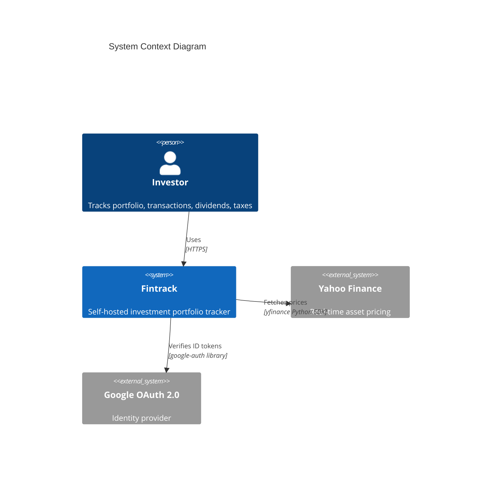
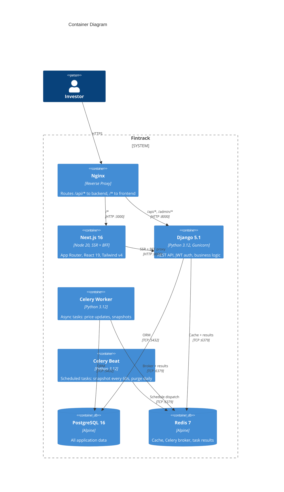
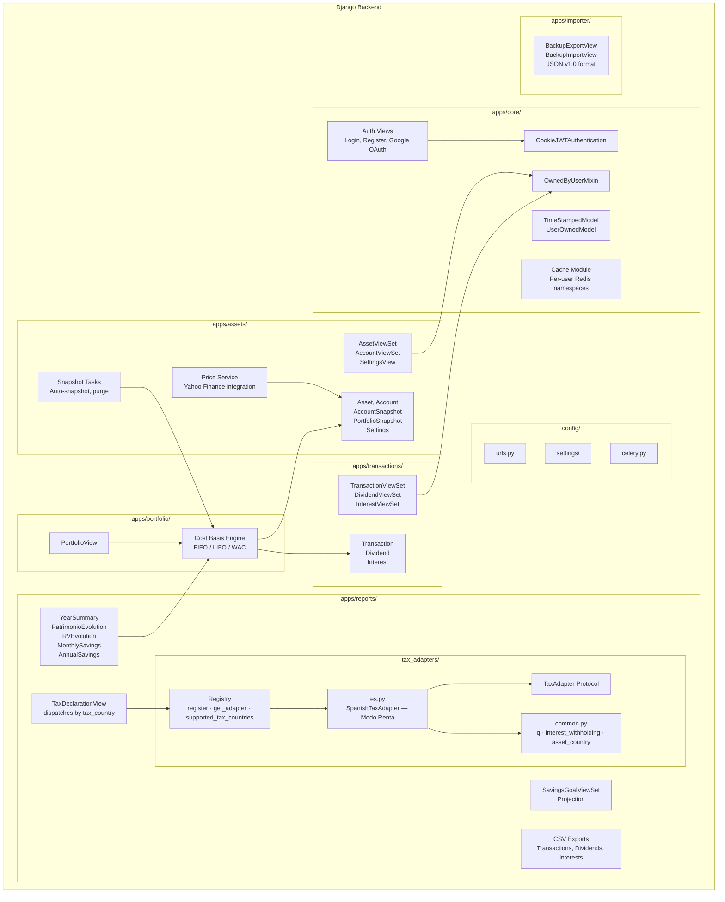
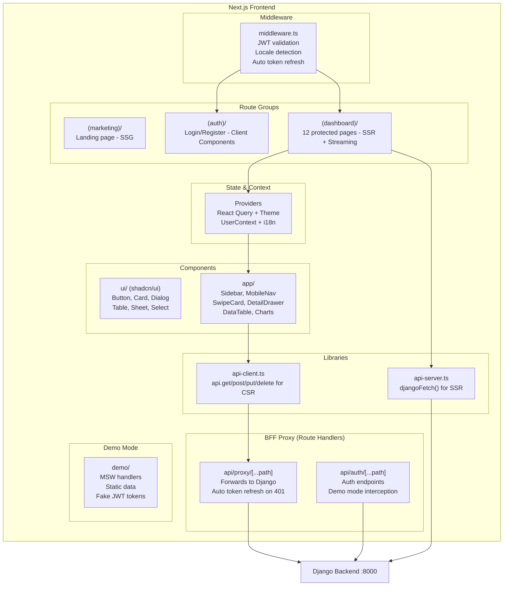
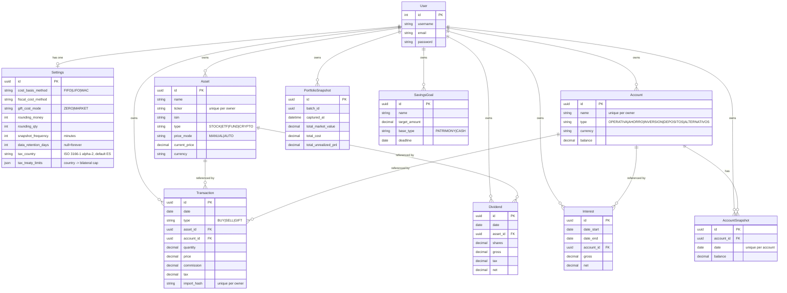
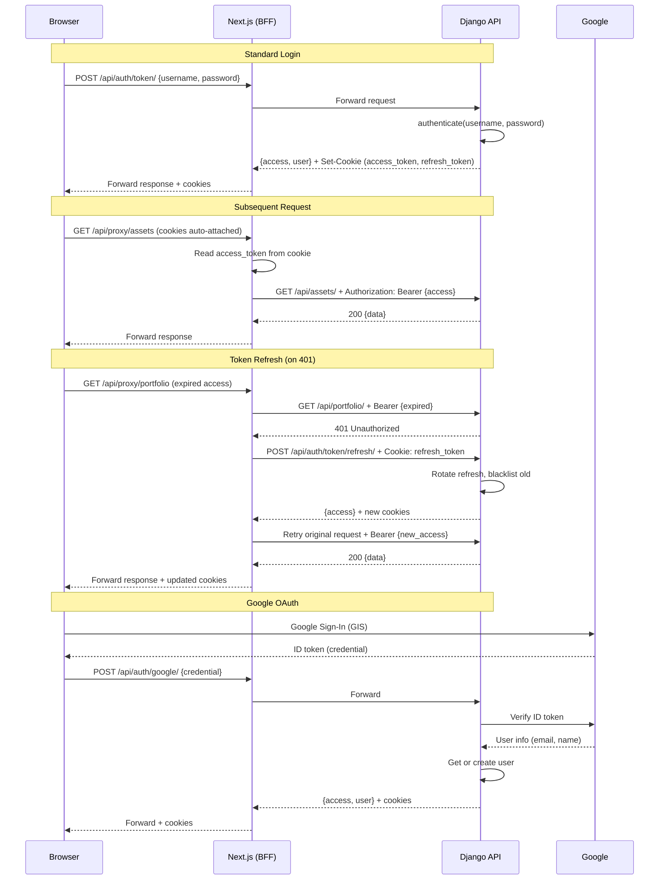
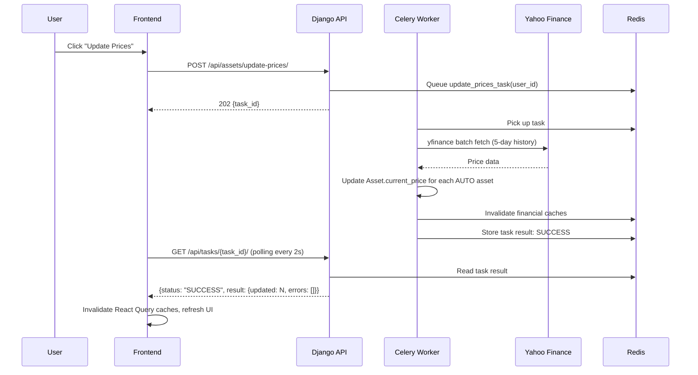
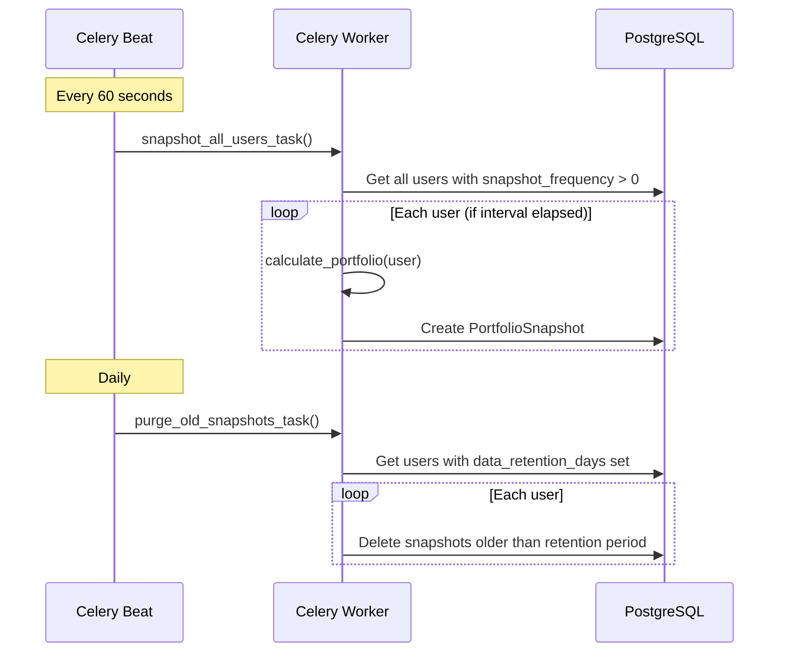
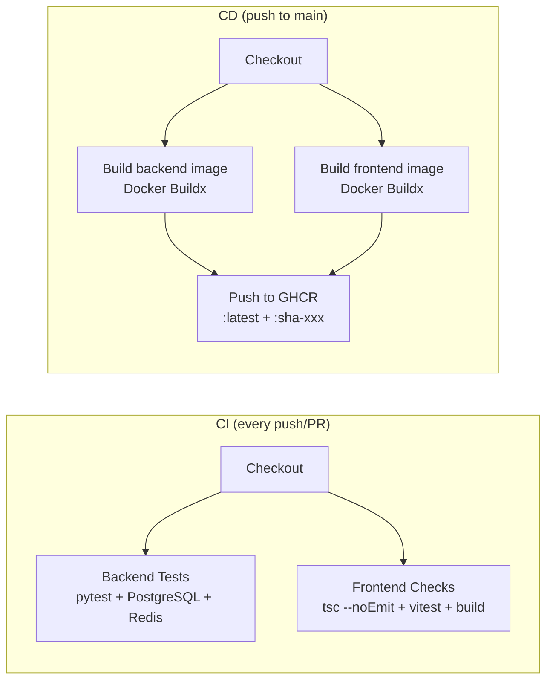

# Fintrack Architecture Documentation

> Self-hosted investment portfolio tracker — Django 5.1 + Next.js 16

---

## Table of Contents

1. [System Context](#1-system-context)
2. [Container Architecture](#2-container-architecture)
3. [Component Architecture](#3-component-architecture)
4. [Data Architecture](#4-data-architecture)
5. [Security Architecture](#5-security-architecture)
6. [Data Flow](#6-data-flow)
7. [Deployment Architecture](#7-deployment-architecture)
8. [Quality Attributes](#8-quality-attributes)
9. [ADR Index](#9-adr-index)

---

## 1. System Context

Fintrack is a self-hosted, multi-tenant investment portfolio tracker. Users interact through a browser; the system integrates with Yahoo Finance for price data and Google OAuth for authentication.



### External Dependencies

| System | Purpose | Protocol | Frequency |
|--------|---------|----------|-----------|
| Yahoo Finance | Asset price updates | yfinance SDK (HTTP) | On-demand (user-triggered) |
| Google OAuth 2.0 | Social login | ID token verification | Per login |

---

## 2. Container Architecture

Six Docker containers orchestrated with Docker Compose.



### Service Details

| Container | Image | Port | Replicas | Healthcheck |
|-----------|-------|------|----------|-------------|
| **frontend** | `ghcr.io/gonzalez8/fintrack-frontend` | 3000 | 1 | — |
| **backend** | `ghcr.io/gonzalez8/fintrack-backend` | 8000 | 1 (3 Gunicorn workers) | `GET /api/health/` |
| **celery_worker** | Same as backend | — | 1 (concurrency 2) | — |
| **celery_beat** | Same as backend | — | 1 | — |
| **db** | `postgres:16-alpine` | 5432 | 1 | `pg_isready` |
| **redis** | `redis:7-alpine` | 6379 | 1 | `redis-cli ping` |

---

## 3. Component Architecture

### 3.1 Backend (Django 5.1 + DRF)



### 3.2 Frontend (Next.js 16 App Router)



### 3.3 Dashboard Pages

| Page | Route | Data Source | Key Components |
|------|-------|------------|----------------|
| Dashboard | `/` | Portfolio, Reports | Summary cards, charts |
| Portfolio | `/portfolio` | `/api/portfolio/` | Position table, P&L |
| Assets | `/assets` | `/api/assets/` | CRUD, price sync |
| Asset Detail | `/assets/[id]` | `/api/assets/{id}/price-history` | Candlestick chart |
| Accounts | `/accounts` | `/api/accounts/` | CRUD, balance snapshots |
| Transactions | `/transactions` | `/api/transactions/` | BUY/SELL/GIFT CRUD |
| Dividends | `/dividends` | `/api/dividends/` | Dividend tracking |
| Interests | `/interests` | `/api/interests/` | Interest income |
| Savings | `/savings` | `/api/reports/monthly-savings/` | Charts, goals, projections |
| Tax Report | `/tax` | `/api/reports/year-summary/` | Yearly breakdown |
| Settings | `/settings` | `/api/settings/` | Cost method, retention |
| Profile | `/profile` | `/api/auth/profile/` | Username, password |

---

## 4. Data Architecture

### 4.1 Entity Relationship Diagram



### 4.2 Multi-Tenancy Model

Every user-owned model inherits from `UserOwnedModel`:

```
UserOwnedModel (abstract)
├── id: UUID (primary key)
├── owner: ForeignKey(User, CASCADE)
├── created_at: DateTimeField
└── updated_at: DateTimeField
```

`OwnedByUserMixin` on ViewSets enforces:
- **Read**: `queryset.filter(owner=request.user)`
- **Create**: auto-injects `owner=request.user`
- **Update/Delete**: only own records, + cache invalidation

### 4.3 Caching Strategy

Per-user Redis namespaces with key format `ft:{user_id}:{namespace}`:

| Namespace | TTL | Invalidated On |
|-----------|-----|----------------|
| `portfolio` | 60s | Transaction/Asset/Account mutation |
| `reports_patrimonio` | 120s | Financial mutation |
| `reports_rv` | 120s | Financial mutation |
| `reports_savings` | 120s | Financial mutation |
| `reports_year` | 120s | Financial mutation |
| `reports_annual_savings` | 120s | Financial mutation |
| `settings` | 3600s | Settings update |

---

## 5. Security Architecture

### 5.1 Authentication Flow



### 5.2 JWT Configuration

| Parameter | Value |
|-----------|-------|
| Access token lifetime | 15 minutes |
| Refresh token lifetime | 7 days |
| Token rotation | Enabled (rotate on refresh) |
| Blacklist after rotation | Enabled |
| Cookie: httpOnly | Yes |
| Cookie: SameSite | Lax |
| Cookie: Secure | True in production |

### 5.3 Security Controls

| Control | Implementation |
|---------|---------------|
| **Rate limiting** | `auth_login`: 10/min, `auth_register`: 10/hour, `auth_password`: 10/hour |
| **CORS** | Explicit origin whitelist via `CORS_ALLOWED_ORIGINS` |
| **CSRF** | Trusted origins required in production |
| **HSTS** | 1 year, include subdomains, preload (production) |
| **SSL redirect** | Configurable via env (production) |
| **Data isolation** | Every query scoped to `owner=request.user` |
| **FK protection** | Assets/Accounts use `PROTECT` — cannot delete if referenced |
| **Import dedup** | `import_hash` unique per owner prevents duplicate imports |
| **Backup limit** | 50 MB max import file size |

### 5.4 Trust Boundaries

```
┌─────────────────────────────────────────────┐
│  UNTRUSTED: Browser                          │
│  - JavaScript, user input                    │
│  - httpOnly cookies (cannot read tokens)     │
└──────────────────┬──────────────────────────┘
                   │ HTTPS
┌──────────────────▼──────────────────────────┐
│  SEMI-TRUSTED: Next.js BFF                   │
│  - Reads cookies, forwards to Django         │
│  - Token refresh logic                       │
│  - Demo mode interception                    │
└──────────────────┬──────────────────────────┘
                   │ HTTP (internal Docker network)
┌──────────────────▼──────────────────────────┐
│  TRUSTED: Django Backend                     │
│  - JWT validation, owner scoping             │
│  - Business logic, database access           │
│  - Rate limiting, CORS enforcement           │
└──────────────────┬──────────────────────────┘
                   │ TCP
┌──────────────────▼──────────────────────────┐
│  TRUSTED: PostgreSQL + Redis                 │
│  - Data persistence, cache, task queue       │
└─────────────────────────────────────────────┘
```

---

## 6. Data Flow

### 6.1 BFF Pattern (Browser-for-Backend)

The browser **never** calls Django directly. All requests flow through Next.js Route Handlers:

```
Browser → /api/proxy/{path} → Next.js Route Handler → Django /api/{path}
```

**Why:**
- JWT tokens stored in httpOnly cookies (browser JS cannot access)
- Next.js reads cookies and attaches `Authorization: Bearer` header
- Transparent token refresh on 401 (user never sees auth failures)
- Demo mode can intercept and return static data without a backend

### 6.2 Rendering Strategy

| Route Group | Strategy | Data Fetching |
|-------------|----------|---------------|
| `(marketing)/` | SSG | None (static) |
| `(auth)/` | Client Components | `authApi.*` (client-side) |
| `(dashboard)/` | SSR + Streaming | `djangoFetch()` for initial load, React Query for mutations |

### 6.3 Price Update Flow



### 6.4 Portfolio Snapshot Flow



---

## 7. Deployment Architecture

### 7.1 Development

```bash
docker compose up  # 6 services, hot reload, ports exposed
```

- Backend: `python manage.py runserver` with volume mount
- Frontend: `npm run dev` with volume mount (excludes node_modules, .next)
- DB + Redis: Ports exposed for local tools

### 7.2 Production

```bash
docker compose -f docker-compose.prod.yml up -d
```

- Pre-built images from GitHub Container Registry (GHCR)
- Backend startup: `migrate → collectstatic → createsuperuser → gunicorn`
- Frontend: `node server.js` (Next.js standalone mode)
- All services: `restart: unless-stopped`
- Nginx (external or built-in): Routes `/api/*` → backend, `/*` → frontend

### 7.3 CI/CD Pipeline



### 7.4 Production Checklist

- [ ] `DJANGO_SECRET_KEY` — 50+ random characters
- [ ] `DB_PASSWORD` — strong, unique
- [ ] `ALLOWED_HOSTS` — your domain only
- [ ] `CORS_ALLOWED_ORIGINS` — `https://your-domain.com`
- [ ] `CSRF_TRUSTED_ORIGINS` — `https://your-domain.com`
- [ ] `DJANGO_SUPERUSER_PASSWORD` — changed from default
- [ ] SSL termination configured (Nginx Proxy Manager, Caddy, etc.)
- [ ] PostgreSQL backup strategy in place

---

## 8. Quality Attributes

### 8.1 Performance

| Aspect | Implementation |
|--------|---------------|
| **API caching** | Per-user Redis namespaces (60-3600s TTL) |
| **Query optimization** | Django ORM select_related/prefetch_related, DB indexes |
| **Frontend caching** | React Query (2min stale, 10min GC) |
| **SSR streaming** | React Suspense for progressive rendering |
| **Static generation** | Marketing pages are SSG (zero runtime cost) |
| **Image optimization** | Next.js standalone with optimized Docker layers |

### 8.2 Scalability

| Dimension | Current | Scaling Path |
|-----------|---------|-------------|
| **API workers** | 3 Gunicorn workers | Increase workers or add replicas behind LB |
| **Async tasks** | Celery concurrency 2 | Add worker containers |
| **Database** | Single PostgreSQL | Read replicas, connection pooling (PgBouncer) |
| **Cache** | Single Redis | Redis Sentinel or Cluster |

### 8.3 Reliability

| Feature | Implementation |
|---------|---------------|
| **Health checks** | All services have Docker healthchecks |
| **Auto-restart** | `restart: unless-stopped` in production |
| **Task retry** | `update_prices_task` retries 3x with 30s backoff |
| **Atomic imports** | Backup import wrapped in DB transaction |
| **Token rotation** | Refresh tokens blacklisted after use (replay-safe) |
| **Graceful degradation** | Demo mode works without backend |

### 8.4 Maintainability

| Practice | Implementation |
|----------|---------------|
| **Multi-tenancy** | Single mixin (`OwnedByUserMixin`) enforces data isolation |
| **Code generation** | shadcn/ui components, OpenAPI schema (drf-spectacular) |
| **Type safety** | TypeScript strict mode, Django type hints |
| **i18n** | 5 languages, key-based translation files |
| **API docs** | Auto-generated Swagger UI at `/api/schema/swagger-ui/` |

---

## 9. ADR Index

Architecture Decision Records documenting key design choices:

| ADR | Title | Status |
|-----|-------|--------|
| [ADR-001](adr/001-bff-pattern.md) | Adopt BFF Pattern (Browser → Next.js → Django) | Accepted |
| [ADR-002](adr/002-jwt-httponly-cookies.md) | Store JWT in httpOnly Cookies | Accepted |
| [ADR-003](adr/003-cost-basis-engine.md) | Build In-House Cost Basis Engine (FIFO/LIFO/WAC) | Accepted |
| [ADR-004](adr/004-multi-tenancy-owner-fk.md) | Multi-Tenancy via Owner Foreign Key | Accepted |
| [ADR-005](adr/005-demo-mode-msw.md) | Demo Mode with MSW and Static Data | Accepted |
| [ADR-006](adr/006-per-user-redis-cache.md) | Per-User Redis Cache Namespaces | Accepted |
| [ADR-007](adr/007-tax-adapter-pattern.md) | Per-Country Tax Adapter Pattern | Accepted |

---

## Appendix: Tech Stack Summary

| Layer | Technology |
|-------|-----------|
| **Backend** | Django 5.1, DRF 3.15, PostgreSQL 16, Celery 5.3, Redis 7 |
| **Auth** | djangorestframework-simplejwt, google-auth |
| **Frontend** | Next.js 16, React 19, TypeScript 5, Tailwind CSS v4, shadcn/ui (Base UI) |
| **State** | TanStack Query 5 (server state) |
| **Charts** | Recharts 3, Lightweight Charts 5 |
| **i18n** | Manual key-based (es, en, de, fr, it) |
| **Infra** | Docker Compose, GitHub Actions CI/CD, GHCR |
| **API Docs** | drf-spectacular (OpenAPI 3 / Swagger UI) |
